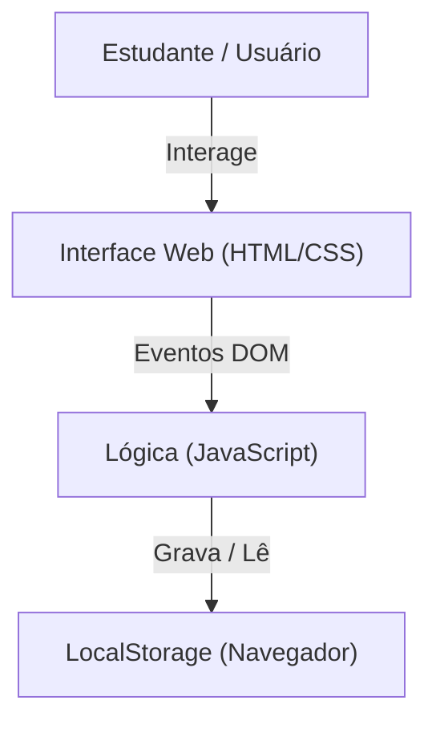
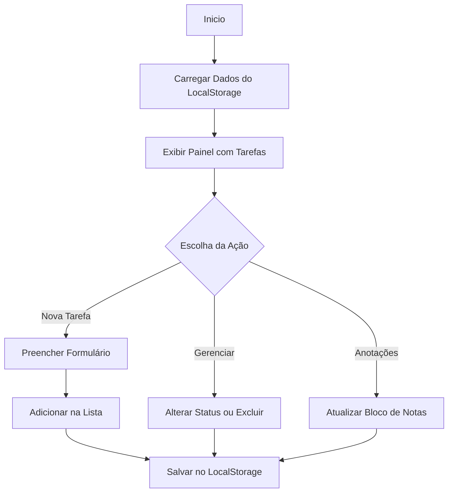

# Relatório de Arquitetura e Modelagem - PieHub

## 1. Visão Geral da Arquitetura
O **PieHub** é uma aplicação web client-side (executada diretamente no navegador do usuário) desenvolvida com HTML5, CSS3 e JavaScript. Os dados inseridos pelo usuário são persistidos localmente por meio da Web Storage API (`localStorage`).



## 2. Diagrama de Fluxo do Usuário (User Flow)
O fluxo do usuário no **PieHub** descreve os caminhos que o estudante percorre ao interagir com a aplicação:



---

## 3. Estrutura de Dados (Web Storage / LocalStorage)
Para manter as informações salvas mesmo se o usuário fechar o navegador, o **PieHub** utiliza o `localStorage` armazenando estruturas em formato JSON.

### Objeto de Tarefas (`piehub_tasks`):
```json
[
  {
    "id": 1724790000000,
    "titulo": "Trabalho de Redes",
    "disciplina": "Redes de Computadores",
    "dataEntrega": "2026-09-05",
    "prioridade": "Alta",
    "status": "Pendente"
  }
]
    N9 --> N3

{
  "conteudo": "Lembrete: Entregar documentação da Etapa 2 do PI-2."
}
